# Persian Rug using Recusion

From [Wikipedia](https://en.wikipedia.org/wiki/Recursion):

> "Recursion is the process a procedure goes through when one of the steps of the procedure involves invoking the procedure itself."

To learn more about recusion, I highly recommend Daniel Shiffman's newly updated [The Nature of Code](https://natureofcode.com) book or his [Recursion Coding Challenge](https://thecodingtrain.com/challenges/77-recursion).

In [Recursion in Nature, Mathematics and Art](https://archive.bridgesmathart.org/2005/bridges2005-9.pdf), Anne Burns discusses using the mid-point algorithm to generate patterns that resemble Persian rugs. The essential idea is to draw a border around a square, and then draw lines connecting the midpoints of the opposite border in a new color which is a function of the colors, $x_i$, in the four corners of the square. This process was illustrated in Figure 10 of the paper.

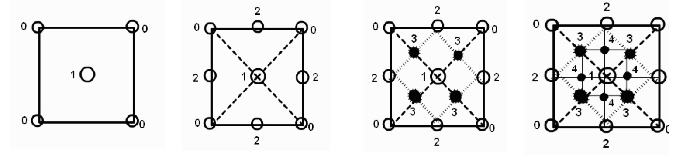

Figure 10 from _Recursion in Nature, Mathematics and Art_

## Processing

I have rendered the Persian rug using several different approaches. The Processing sketch renders the fastest, so I will discuss it first. I am using an adapted version of a method I found on [stackoverflow](https://stackoverflow.com/questions/26226531/persian-rug-recursion). I added HSB colorMode and I am taking the sum of the color values retrieved by the [get()](https://processing.org/reference/get_.html) function in the 4 corners and dividing by a = random(1, n). Different values of n yield different images, but I there is a limit to how high n can get. In general, this approach yields good patterns, but it can also yield a relatively boring pattern. I have not completely flushed out the circumstances under which this occurs. I will also note that while the images are quite lovely, they do not (at least in my opinion) look exactly like Persian rugs.

$f(x_1 + x_2 + x_3 + x_4) = (c_1 + c_2 + c_3 + c_4) / a$

[processing sketch](persian_rug_processing/sketch.pde)

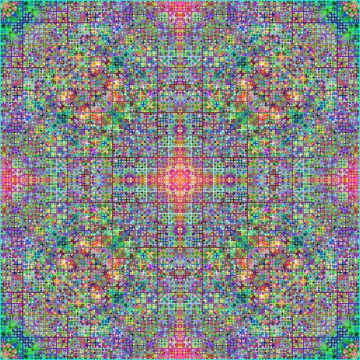

## P5.js

In the P5.js sketch, I am summing just the r values of the four corners retrieved by the [get()](https://p5js.org/reference/p5/get/) function, $c_i$, but I am dividing by 360. Through trial and error, I have discovered that if the resulting value is 300, the pattern isn't very good and I have therefore eliminited this as an option. As you would expect, the P5.js sketch is **siginificantly** slower to render. I have tried various strategies to increase the rendering speed, including adding a buffer and creating a PersianRug class. None of these approaches made much of a difference. I also experimented with retrieving the colors using the pixel() function as the P5.js documentation claims that it will be faster, but that change did not seem to speed up the render. I also want to note that while I might be mistaken about this, there appears to be a bug in P5.js when retrieving the last pixel in the canvas: console.logs revealed that the r value was off by 2. This slight discrepency was enough to cause the algorithm to fail (in the palette approach), so I added a 2 pixel wide border and am retrieving the border of the rect(1,1,w,w), with a (w+1)x(w+1) canvas.

$f(x_1 + x_2 + x_3 + x_4) = (c_1[0] + c_2[0]+ c_3[0] + c_4[0]) / 360$

[p5 sketch](https://editor.p5js.org/kfahn/sketches/65HDqIkba)

The last method is the most computationally intensive, but if you wanted to use specific colors you might want to use this approach. I have used a method suggested by Dr. Eric Gossett in [Persian Rugs](https://www.youtube.com/watch?v=0wfPlzPvZiQ) to compute the next color. In this approach, the function returns an index into a color palette of HEX codes. This method is more convoluted, as I am converting the RGB values retrieved from the get() function to a HEX code, getting the keys into the palette array, $k_i$, and then use the formula to calculate the new key. Shift is an integer to add more variation to the rug generation. We find sum of the keys and shift, modulus the number of colors (ncol). The index must be an integer into the color palette, so we take the floor of the result.

$f(x_1 + x_2 + x_3 + x_f) = $floor$((k_1 + k_2 + k_3 + k_4 + $shift) % ncol)

I am using a very handy resource [supercolorpalette](https://supercolorpalette.com) to find nice color palettes.

[p5 sketch](https://editor.p5js.org/kfahn/sketches/2KJqdr_MC)

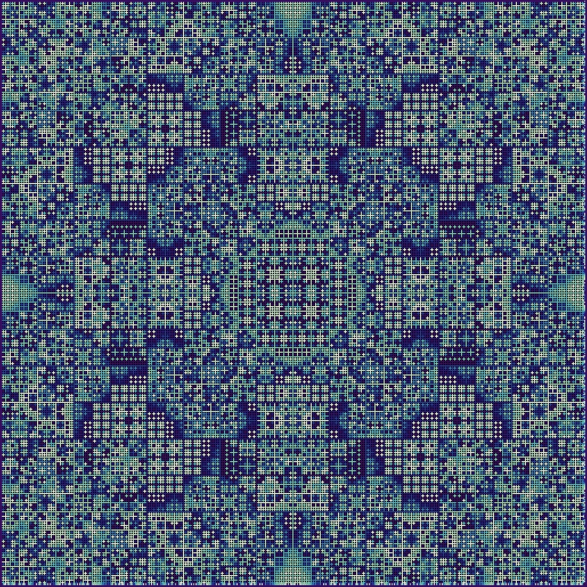

## Gallery

<!-- IMAGE-LIST:START - Do not remove or modify this section -->
<!-- prettier-ignore-start -->
<!-- markdownlint-disable -->
<table>
  <tbody>
  <tr>
      <td align="center"><a href=""> 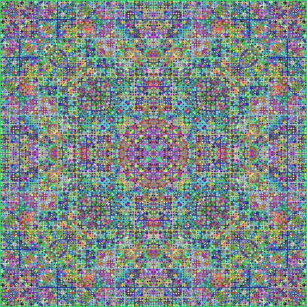 <b> Persian rug created with Processing</b></a></td>
      <td align="center"><a href=""> 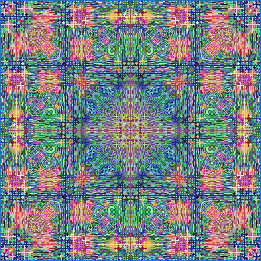 <b> Persian rug created with Processing</b></a></td>
      <td align="center"><a href=""> 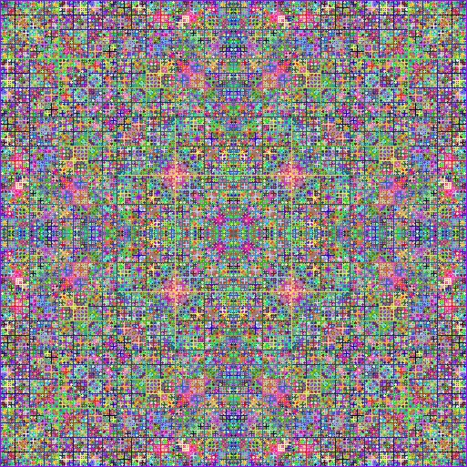 <b> Persian rug created with Processing</b></a></td>
     <td align="center"><a href=""> 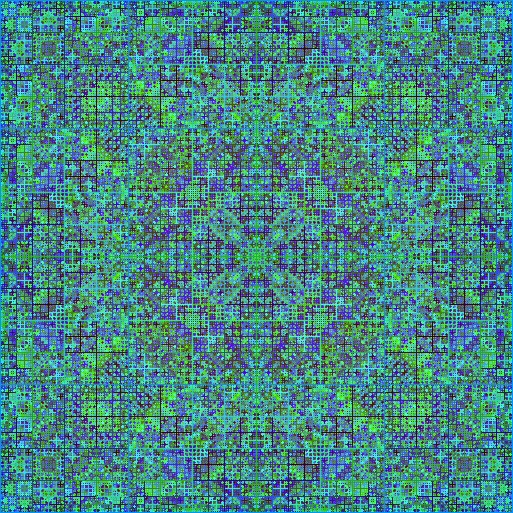 <b> Persian rug created with Processing</b></a></td>
</tr>
  <tr>
      <td align="center"><a href=""> 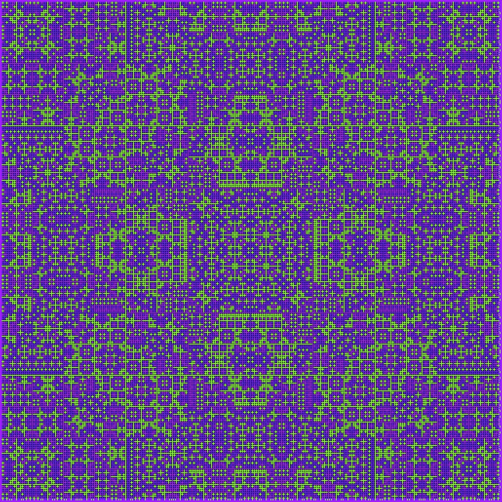 <b> Persian rug with color palette</b></a></td>
      <td align="center"><a href=""> 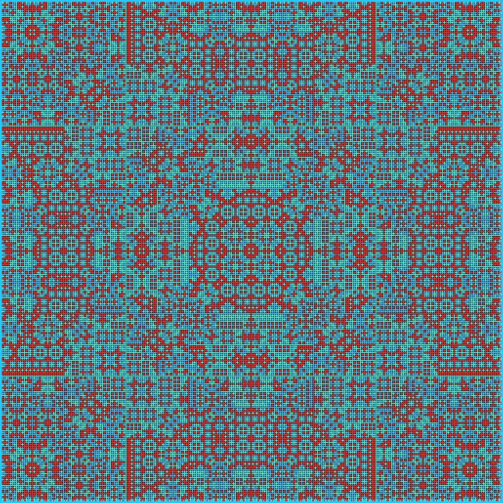 <b> Persian rug with color palette</b></a></td>
      <td align="center"><a href=""> 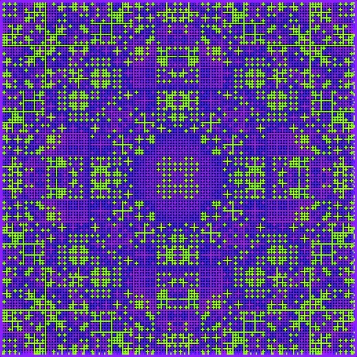 <b> Persian rug with color palette, n = 6</b></a></td>
     <td align="center"><a href=""> 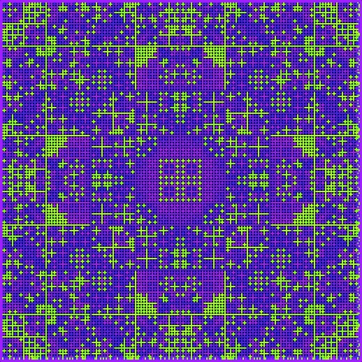 <b> Persian rug with color palette, n = 6</b></a></td>
</tr>
<tr>
      <td align="center"><a href=""> 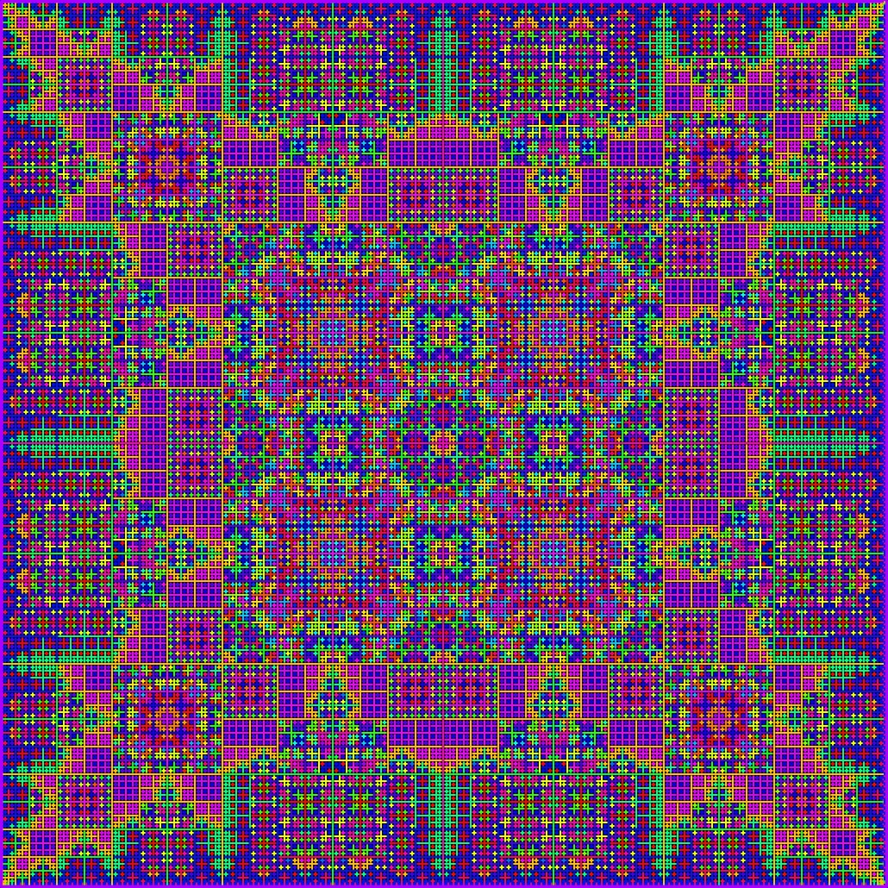 <b> Persian rug with random colors</b></a></td>
       <td align="center"><a href=""> 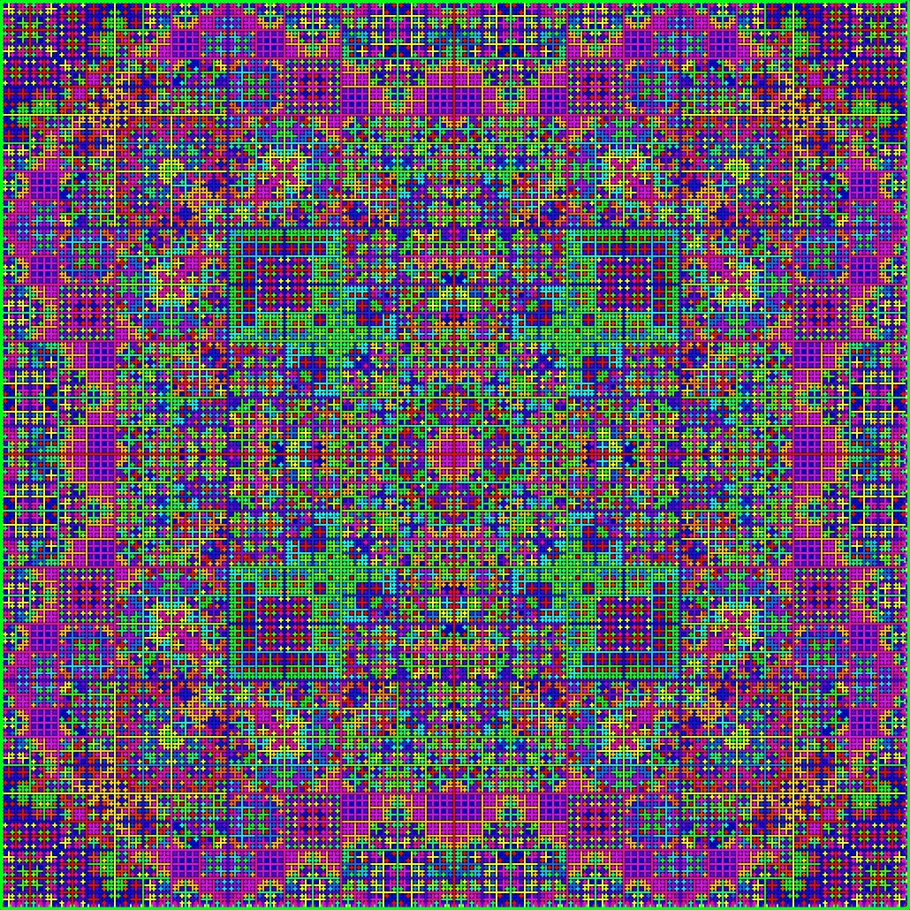 <b> Persian rug with random colors</b></a></td>
      <td align="center"><a href=""> 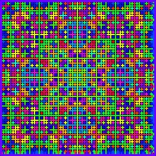 <b> Persian rug with random colors</b></a></td>
     <td align="center"><a href=""> 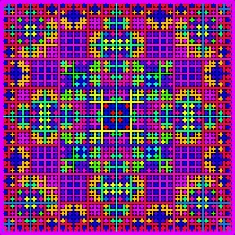 <b> Persian rug with random colors</b></a></td>
</tr> 
 </tbody>
</table>

<!-- markdownlint-restore -->
<!-- prettier-ignore-end -->

<!-- IMAGE-LIST:END -->
