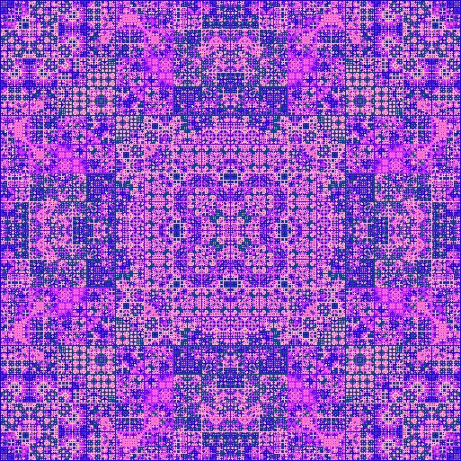
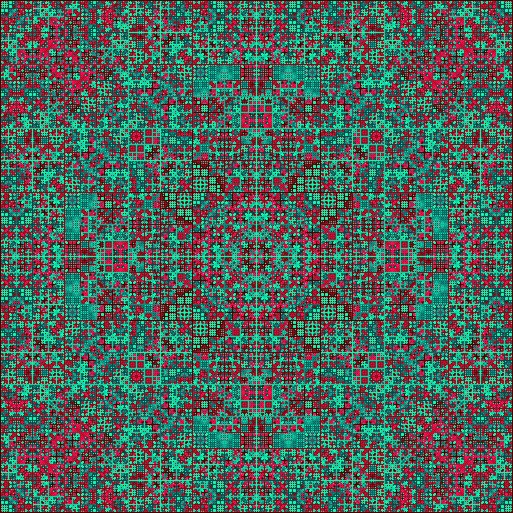
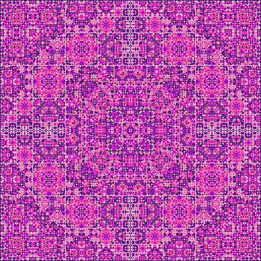
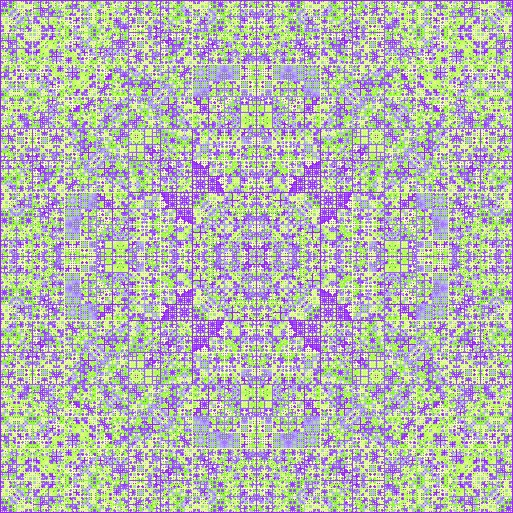

# Persian Rug using Recursion using Processing

From [Wikipedia](https://en.wikipedia.org/wiki/Recursion):

> "Recursion is the process a procedure goes through when one of the steps of the procedure involves invoking the procedure itself."

To learn more about recusion, I highly recommend Daniel Shiffman's newly updated [The Nature of Code](https://natureofcode.com) book or his [Recursion Coding Challenge](https://thecodingtrain.com/challenges/77-recursion).

In [Recursion in Nature, Mathematics and Art](https://archive.bridgesmathart.org/2005/bridges2005-9.pdf), Anne Burns discusses using the mid-point algorithm to generate patterns that resemble Persian rugs. The essential idea is to draw a border around a square, and then draw lines connecting the midpoints of the opposite border in a new color which is a function of the colors, $x_i$, in the four corners of the square. This process was illustrated in Figure 10 of the paper.

Figure 10 from _Recursion in Nature, Mathematics and Art_

The sketch is an adapted version of this [code](https://stackoverflow.com/questions/26226531/persian-rug-recursion). I have used a method suggested by Dr. Eric Gossett in [Persian Rugs](https://www.youtube.com/watch?v=0wfPlzPvZiQ) to compute the next color. In this approach, we first retrieve the color, $c_i$, of the four corners using the get() function and then find the index, $i_i$, associated with that color. We then calculate then new index using the following formula, where shift is an integer to add more variation to the rug generation.

$f(x_1 + x_2 + x_3 + x_4) = (i_1 + i_2+ i_3 + i_4$ + shift) % palette.length

I initially had difficulty retrieving a valid index into the color array. After trouble-shooting, I determined that the get() function does not appear to be returning the exact r, g, b values. I have dealt with this by comparing the absolute value of the difference between the r, g, and b values of $c_i$ and the palette colors.

## Gallery

<!-- IMAGE-LIST:START - Do not remove or modify this section -->
<!-- prettier-ignore-start -->
<!-- markdownlint-disable -->
<table>
  <tbody>
      <tr>
      <td align="center"><a href="">  <b> Persian rug from color palette</b></a></td>
     <td align="center"><a href="">  <b> Persian rug from color palette</b></a></td>
</tr>
  <tr>
      <td align="center"><a href="">  <b> Persian rug from color palette</b></a></td>
     <td align="center"><a href="">  <b> Persian rug from color palette</b></a></td>
</tr>

 </tbody>
</table>

<!-- markdownlint-restore -->
<!-- prettier-ignore-end -->

<!-- IMAGE-LIST:END -->
