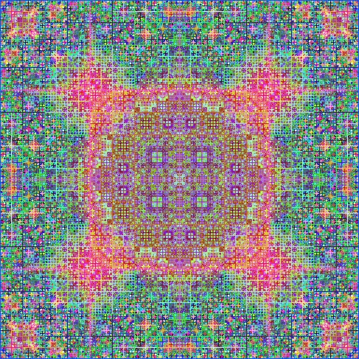

# Persian Rug Algorithm

In [Recursion in Nature, Mathematics and Art](https://archive.bridgesmathart.org/2005/bridges2005-9.pdf), Anne Burns discusses using the mid-point algorithm to generate patterns that resemble Persian rugs. The essential idea is to draw a border around a square, and then draw lines connecting the midpoints of the opposite border in a new color which is a function of the color in the corners of the square. There are two approaches. In the first, I am using HSB colorMode. A random color is choosen for the border and then the next color is choosen by dividing by 360.

$f(k_1 + k_2 + k_3 + k_f) = (k_1 + k_2 + k_3 + k_4) / a$
where:
a = random(1,6) for the Processing version
a = 360 for the P5.js sketch version

  
[processing sketch](persian_rug_processing/sketch.pde)

  
[p5 sketch](https://editor.p5js.org/kfahn/sketches/65HDqIkba)

In the second, the function find an index into the color palette. This method was suggested by Dr. Eric Gossett in [Persian Rugs](https://www.youtube.com/watch?v=0wfPlzPvZiQ), where k is an index into an array of colors. Shift is an integer to add more variation to the rug generation. We find sum of the keys and shift, modulus the number of colors (ncol) to return an index into the color palette. We color the lines by the new color.

$f(k_1 + k_2 + k_3 + k_f) = (k_1 + k_2 + k_3 + k_4 + shift)$ % ncol

I am using a color palette reetrieved from [supercolorpalette](https://supercolorpalette.com).

  
[p5 sketch](https://editor.p5js.org/kfahn/sketches/2KJqdr_MC)

## Gallery

<!-- IMAGE-LIST:START - Do not remove or modify this section -->
<!-- prettier-ignore-start -->
<!-- markdownlint-disable -->
<table>
  <tbody>
  <tr>
      <td align="center"><a href="">  <b> Persian rug created with Processing</b></a></td>
      <td align="center"><a href="">  <b> Persian rug created with Processing</b></a></td>
      <td align="center"><a href="">  <b> Persian rug created with Processing</b></a></td>
     <td align="center"><a href="">  <b> Persian rug created with Processing</b></a></td>
</tr>
  <tr>
      <td align="center"><a href="">  <b> Persian rug with color palette</b></a></td>
      <td align="center"><a href="">  <b> Persian rug with color palette</b></a></td>
      <td align="center"><a href="">  <b> Persian rug with color palette, n = 6</b></a></td>
     <td align="center"><a href="">  <b> Persian rug with color palette, n = 6</b></a></td>
</tr>
<tr>
      <td align="center"><a href="">  <b> Persian rug with random colors</b></a></td>
       <td align="center"><a href="">  <b> Persian rug with random colors</b></a></td>
      <td align="center"><a href="">  <b> Persian rug with random colors</b></a></td>
     <td align="center"><a href="">  <b> Persian rug with random colors</b></a></td>
</tr> 
 </tbody>
</table>

<!-- markdownlint-restore -->
<!-- prettier-ignore-end -->

<!-- IMAGE-LIST:END -->

## References

- [Recursion in Nature, Mathematics and Art](https://archive.bridgesmathart.org/2005/bridges2005-9.pdf)

- [Recursion Coding Challenge](https://thecodingtrain.com/challenges/77-recursion)

-

- [Persian rug recursion](https://stackoverflow.com/questions/26226531/persian-rug-recursion)
